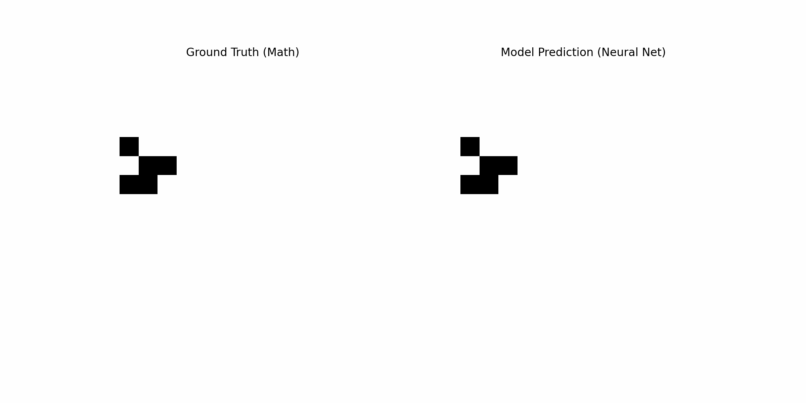

# Teaching a Neural Network the Rules of Life

Can a continuous neural network learn the discrete, sharp rules of Conway's Game of Life? **NeuralGameOfLife** demonstrates that a tiny Convolutional Neural Network (CNN) can approximate these cellular automata rules with near-perfect accuracy.

## Demo: Model vs. Reality


*Side-by-side comparison: The Neural Network's predictions (Left) vs. The actual Game of Life rules (Right).*

## How it Works

The project uses **PyTorch** to train a compact CNN that treats the Game of Life grid as an image. The model learns to predict the next state of a cell based on its neighbors, effectively deriving the game's rules (underpopulation, survival, overpopulation, reproduction) purely from data.

The architecture (`src/model.py`) consists of three specific layers designed to mimic the logical steps of the game:

1.  **Feature Extraction (The Moore Neighborhood):**
    * A `Conv2d` layer with a 3x3 kernel.
    * **Crucial Detail:** Uses **circular padding** (`padding_mode='circular'`) to handle the toroidal wrapping of the grid edges, ensuring the "world" has no boundaries.
2.  **Logic Processing:**
    * A `Conv2d` layer with a 1x1 kernel (16 channels).
    * This acts as a dense layer applied to every pixel independently, allowing the network to process the "neighbor count" features extracted by the first layer.
3.  **Prediction:**
    * A final `Conv2d` layer with a 1x1 kernel and a **Sigmoid** activation.
    * Outputs a probability (0 to 1) indicating whether a cell will be alive or dead in the next generation.

## Data Generation & Efficient Logic

To train the network, we generate a dataset of random grid states and their corresponding "next" states.

* **The Dataset:** The `LifeDataset` class creates **10,000 samples**. Each sample is initialized as a random grid (default 20x20) with a **20% density** of alive cells.
* **Convolutional Ground Truth:** Calculating the next state for thousands of grids using standard loops is slow. Instead, `src/data.py` uses a highly efficient **2D convolution** approach to generate the ground truth labels:
    1.  **Neighbor Counting:** A fixed 3x3 kernel `K` (containing 1s for neighbors and 0 for the center) is convolved over the grid. This sums the neighbors for every cell simultaneously.
    2.  **Vectorized Rules:** The Game of Life rules are applied using fast NumPy masking:
        ```python
        # Alive if 3 neighbors, or (Alive AND 2 neighbors)
        new_grid = (neighbor_counts == 3) + grid * (neighbor_counts == 2)
        ```

## Installation

Clone the repository and install the required dependencies:

```bash
pip install -r requirements.txt
```

## Usage

### 1. Visualize & Compare

To see the model in action immediately, run the visualiser script. This will **train a fresh model (30 epochs)** on the fly and generate a side-by-side comparison GIF of a Glider pattern.

Bash

```
python src/visualiser.py
```

_Outputs: `model_vs_reality_glider.gif`_

### 2. Train & Validate

To run a full training loop with validation and save the model for later use, use `main.py`.

Bash

```
python main.py
```

**Optional Arguments:** You can tweak the training parameters using command-line flags:

- `--epochs`: Number of training epochs (default: 10).
    
- `--grid_size`: Size of the training grid (default: 20).
    
- `--reverse`: Train the model to predict the _previous_ state from the current one (Time Reversal task).
    
    > **Note on Reversibility:** Mathematically, the Game of Life is not reversible. The rules are non-injective, meaning multiple different past configurations can evolve into the exact same future state, causing information loss. In this mode, the neural network attempts to approximate the most probable previous state despite this inherent ambiguity.
    

Bash

```
python main.py --epochs 50 --grid_size 30 --reverse
```

